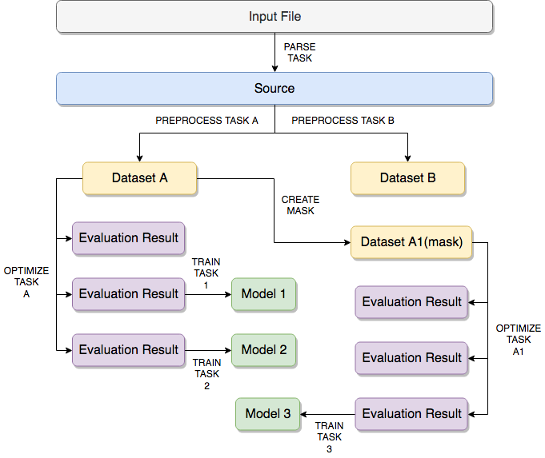
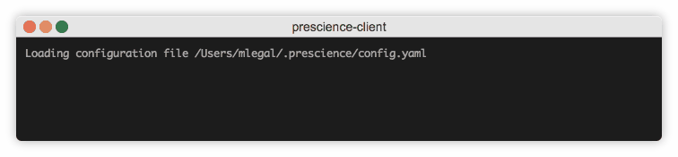
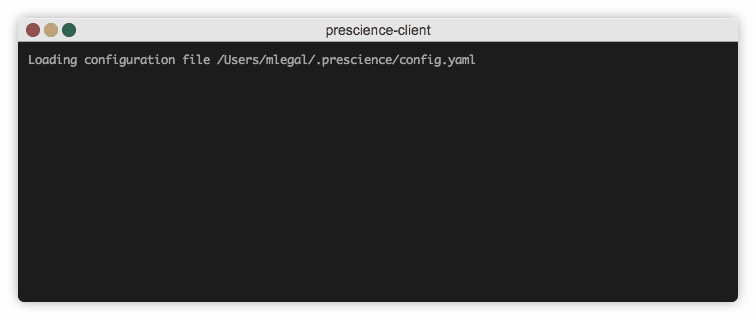
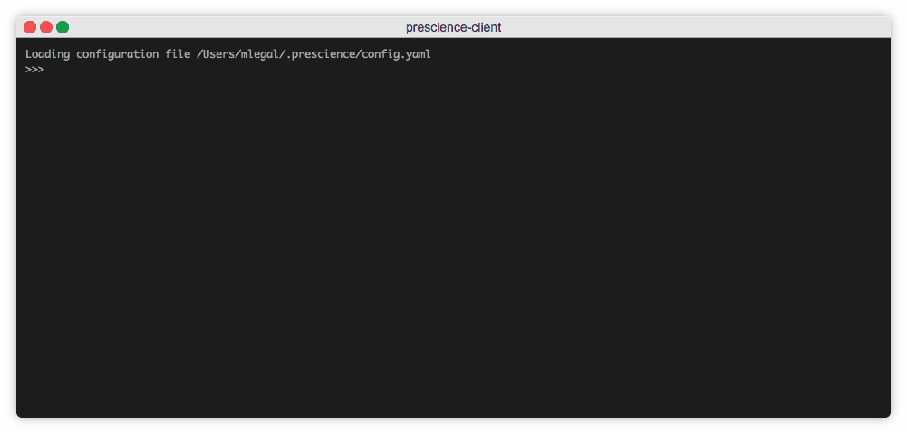
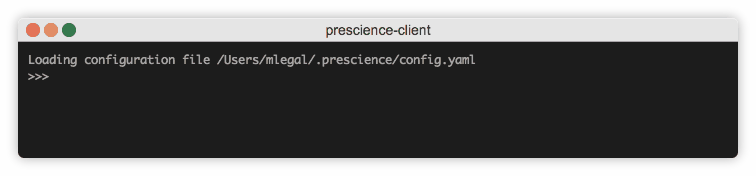
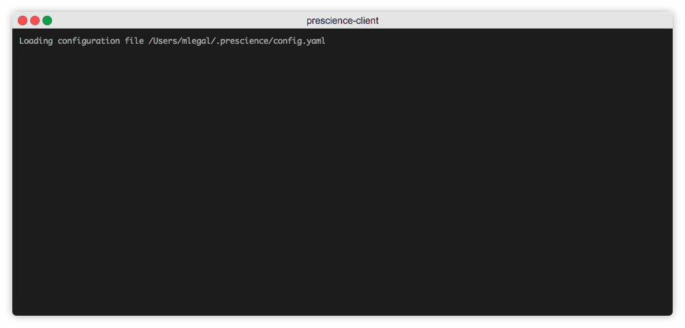
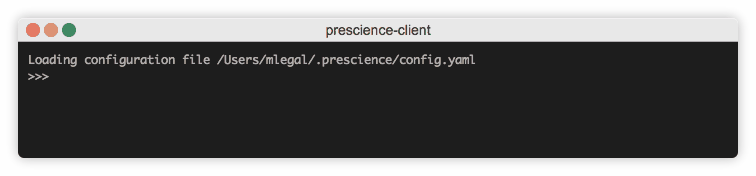
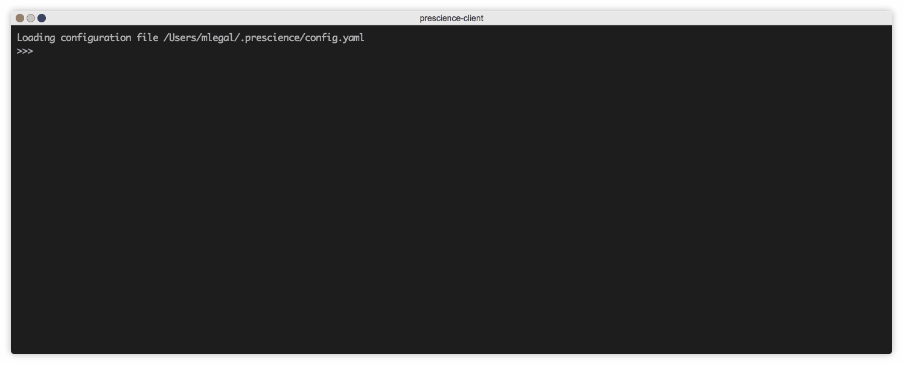

# Python client for OVH Prescience

The `OVH Prescience` project is a distributed machine learning tool used for training and deploying `supervised algorithms` and their `models`.

This open-source `python library` allows you to interact with all your `Prescience` projects.

Depending on your needs and your knowledge of programmation langages, this python library is not necessarily the tool that best suit you. Here are the other choices you could prefer :

* Use [prescience web client](https://prescience.ai.ovh.net/login) inside you web browser
    * The documentation for this web client is available [here](https://docs.ovh.com/fr/prescience/premiers-pas-avec-ovh-prescience/)
* Use prescience [web service api](https://prescience-api.ai.ovh.net/) with your own langage
    *  The documentation for this API is available [here](https://docs.ovh.com/fr/prescience/premiers-pas-avec-ovh-prescience-api/)
    

## Prerequisites

This documentation assumes you already have a prescience token allowing you to work on the prescience servers.

You can request a token [here](https://survey.ovh.com/index.php/379341?lang=en)

You have 2 ways of runing the client :
* with docker
* with python, in this case you will need at least `python 3.6`

## Build and run with pip

Install it :
```bash
pip install git+https://github.com/ovh/prescience-client.git
```

Run it inside a python cli (or python script)
```python
from prescience_client import prescience
# Print the current configuration on standard output
prescience.config().show()
```

Run it in a bash console
```bash
# Display all the command and help information
prescience --help
```

Activate the autocompletion for bash console (or zsh)

```bash
eval "$(register-python-argcomplete prescience)"
```

For this running mode you'll find a `cheat sheet` at the end of this README.


## Build and run it with docker

On the root directory of `python-client` there is a `Dockerfile`.

You can compile a docker image of the python client by doing so :

```sh
docker build -t prescience-client .
```

If you want to directly include a default prescience token to use with the docker image you can pass a build argument with the `docker` command :

```sh
export PRESCIENCE_DEFAULT_TOKEN=<your-token-here>
docker build -t prescience-client --build-arg DEFAULT_TOKEN=$PRESCIENCE_DEFAULT_TOKEN .
```

Once your docker container is buit, you can launch the `python-client` by doing so:

```
docker run --rm -it prescience-client
```

It is still possible to override the default prescience token on runtime by setting the `PRESCIENCE_DEFAULT_TOKEN` environnement variable.

```
docker run --rm -it -e "PRESCIENCE_DEFAULT_TOKEN=<your-token-here>" prescience-client
```

## Configuration

The prescience client configuration file will be automatically created inside your `HOME` directory in `yaml` format.

```bash
# Prescience client configuration file :
${HOME}/.prescience/config.yaml

# Inside the docker container, it will be under :
/root/.prescience/config.yaml
```

The content of this file will look like this :

```yaml
current_project: "project-1"
environments:
  default:
    api_url: "https://prescience-api.ai.ovh.net"
    websocket_url: "wss://prescience-websocket.ai.ovh.net"
    serving_url: "https://prescience-serving.ai.ovh.net"
projects:
  project-1:
    token: "<token-for-project1>"
    environment: "default"
  project-2:
    token: "<token-for-project2>"
    environment: "default"
```

You can register here as many projects as you want. The `key` of each configuration part inside `projects` will be your chosen name for each project.

| Parameter 	    | Description                                             | Default value 	                          |
|-----------	    |------------------------------------------------------	  |-------------------                        |
| `environment`     | The name of the prescience environment for this project | `wss://prescience-websocket.ai.ovh.net`   |
| `token`           | The token to use for this project                       |                                           |

`current_project` indicates your currently selected project (this is the one you're currently working on)

### Registering a new project

```python
# It will automaticaly save this new project inside the configuration file
prescience.config().set_project(
    project_name='my-project',
    token='<your-prescience-token>'
)
```

### Switching the current working project

```python
# It will automaticaly save this new current project inside the configuration file
prescience.config().set_current_project('my-project')
```

## Prescience object model



## Sources

### Create a source with a `parse` task

A `source` is created from a local file on your computer.

Here are the supported formats of input files :
* csv with `,`, `;` or `\t` delimiter
* parquet

The prescience task responsible for constructing a `source` object is the `parse` task.
You can launch a parse task like this :

```python
# Create a csv local input file object
input_file = prescience.csv_local_input('/path/to/your/data.csv')

# Upload your input file on prescience and launch a parsing task on it
parse_task = input_file.parse(source_id='my-source')

# Wait until the task is complete or failed
parse_task.watch()
```

Here are the available parameters for the `parse` method :

| Parameter 	| Description                                                                                  	|
|-----------	|----------------------------------------------------------------------------------------------	|
| source_id 	| The name of the source that will be created. This identifier must be unique in your project. 	|
|           	|                                                                                              	|

#### Example


### Access your sources list
You can get the paginated list of all the sources in your project by calling the `sources` method on `prescience` :

```python
# 'page' parameter is the number of the page you want to get
source_page_1 = prescience.sources()
```

Here are the available parameters for the `source` method :

| Parameter 	| Description                                                   | Default value 	|
|-----------	|------------------------------------------------------	        |-------------------|
| page       	| The number of the wanted source page that you want to get. 	| 1                 |

You can display the content of the page by calling the `show()` function on your page.
```python
source_page_1.show()
```

#### Example


### Access a single source from its `source_id`

```python
# Access a source from its source_id
my_source = prescience.source(source_id='my-source')
# Display a summary of your source object
my_source.show()
```

### Access the schema of a `source`

```python
# Get the schema of your source computed by the parse task
my_source_schema = my_source.schema()
# Display the computed schema of the source
my_source_schema.show()
```

#### Example


## Dataset

### Create a dataset with a `preprocess` task

A `dataset` is created from a `source`. A single `source` can have a lot of childs datasets.

The prescience task responsible for constructing a `dataset` object is the `preprocess` task.
You can launch a preprocess task like this :

```python
# Access your previously created source object
my_source = prescience.source(source_id='my-source')

# Launch a preprocess task on your source
preprocess_task = my_source.preprocess(dataset_id='my-dataset')

# Wait until the task is complete or failed
preprocess_task.watch()
```

Here are the available parameters for the `preprocess` method :

| Parameter 	    | Description                                                                                  	| Default value     |
|-----------	    |----------------------------------------------------------------------------------------------	|---------------    |
| dataset_id 	    | The name of the dataset that will be created. This identifier must be unique in your project. |                   |
| label             | The name of your label column. It's the field you want to predict                             | `label`           |
| problem_type      | The type of your problem : `classification` or `regression`                                   | `classification`  |

#### Example


### Create a dataset from another dataset

If you want to create a dataset owning only a subset of another dataset's columns you'll need to create a `mask` of your existing dataset.

```python
# Access your initial dataset
my_dataset = prescience.dataset(dataset_id='my-dataset')

# Create a mask containing a subset of inital columns
keep_columns = ['label', 'random-bool', 'native-country', 'hours-per-week']
my_dataset_mask = my_dataset.create_mask(mask_id='my_dataset_mask', selected_column=keep_columns)
```

### Access your datasets list
You can get the paginated list of all the datasets in your project by calling the `datasets` method on `prescience` :

```python
# 'page' parameter is the number of the page you want to get
dataset_page_1 = prescience.datasets()
```

Here are the available parameters for the `datasets` method :

| Parameter 	| Description                                                   | Default value 	|
|-----------	|------------------------------------------------------	        |-------------------|
| page       	| The number of the wanted dataset page that you want to get. 	| 1                 |

You can display the content of the page by calling the `show()` function on your page.
```python
dataset_page_1.show()
```

#### Example


### Access a single dataset from its `dataset_id`

```python
# Access a dataset from its dataset_id
my_dataset = prescience.dataset(dataset_id='my-dataset')
# Display a summary of your dataset object
my_dataset.show()
```

### Access the schema of a `dataset`

The schema of a `dataset` is the same as its underlying `source` except that the dropped and kept columns are displayed with colors on the `show()` method call.

```python
# Get the schema of your dataset
my_dataset_schema = my_dataset.schema()
# Display the computed schema of the dataset
my_dataset_schema.show()
```

#### Example


## Optimization

Once you have a dataset with preprocessed columns, you'll need to launch an optimization in order to find the best configuration (algorithm + associated hyperparameters) that will suit you needs.

A configuration is tested on each optimization iteration and the result is stored inside an object called `evaluation result`.

### Launching an optimization from a `dataset`

```python
# Launch an optimize task
optimize_task = my_dataset.optimize(budget=10)
# Wait until the optimize task is over
optimize_task.watch()
```

#### Example


## Access `evaluation results` from a `dataset`

```python
# Access the paginated list of evaluation results for our dataset
evaluation_result_page_1 = my_dataset.evaluation_results()
# Display all evaluation results computed for our dataset
evaluation_result_page_1.show()
# Access a single evaluation result from its index on the page
wanted_evaluation_result = evaluation_result_page_1.content[9]
```

#### Example


## Model

A `model` can be created from an `evaluation result`. When you choose to `train` a `model` the same configuration than the selected `evaluation result` will be used.
Once a `model` has been trained it is also deployed and you can query it.

### Train a model from an `evaluation result`

```python
# Launch a train task from an evaluation result
wanted_evaluation_result.train(model_id='my-model').watch()
```

### Access your model list
You can get the paginated list of all the models in your project by calling the `models` method on `prescience` :

```python
# 'page' parameter is the number of the page you want to get
models_page_1 = prescience.models()
```

Here are the available parameters for the `datasets` method :

| Parameter 	| Description                                           | Default value 	|
|-----------	|------------------------------------------------------	|-------------------|
| page       	| The number of the dataset page that you want to get. 	| 1                 |

You can display the content of the page by calling the `show()` function on your page.
```python
models_page_1.show()
```

## Model evaluation and predictions

Once your model has been train and deployed on prescience, you can request it for making predictions.

First you need to create and fill the input payload that will contain all the parameters you need by doing so :

```python
# Get your model
my_model = prescience.model('my-model')
payload = my_model.get_model_evaluation_payload()
```

You can display the content of your payload thank's to the `show` method. It will display all the parameters you can set and it will show you if your filled values are correct.

```python
payload.show()
```

You can fill arguments on your payload by doing so :

```python
# Fill one arguments on the payload
payload.add_payload_argument('feature_1', 'value_1')

## Fill several arguments on the payload
payload.add_payload_arguments({'feature_1': 'value_1', 'feature_2': 'value_2'})
```

Once you have filled all your wanted arguments, you can ask prescience to make a prediction by calling the `evaluate` method :

```python
# Ask prescience to make a prediction accordingly to your filled arguments
result = payload.evaluate()
# Display the prediction result on standard output
result.show()
# Access the label of the results
prediction_label = result.get_result_label()
# Access the probabilities (only available on specific models)
label_probabilities = result.get_result_probabilities()
```

#### Example


# Console mode cheat sheet

```bash
# Show prescience-client config
prescience config get
# Switch current working project to <project-name>
prescience config switch <project-name>

# Show all sources
prescience get sources
# Show all datasets
prescience get datasets
# Show all models
prescience get models
# Show single source
prescience get source '<source-id>'
# Show single dataset
prescience get dataset '<dataset-id>'
# Show the schema of a dataset
prescience get dataset '<dataset-id>' --schema
# Show the evaluation results of a dataset
prescience get dataset '<dataset-id>' --eval
# Show single model
prescience get model '<model-id>'

# Delete a source
prescience delete source '<source-id>'
# Delete a source
prescience delete dataset '<dataset-id>'
# Delete a source
prescience delete model '<model-id>'

# Start a parse task and watch for it
prescience start parse <input-file> <source-id> --watch
# Start a preprocess task and watch for it
prescience start preprocess <source-id>  <dataset-id> --watch
# Start a optimize task and watch for it
prescience start optimize <dataset-id> <budget> --watch
# Start a train task and watch for it
prescience start train <evaluation-result-uuid> <model-id> --watch

# Validate your prediction request
prescience predict <model-id> --json '<json-arguments>' --validate
# Make on prediction from a model
prescience predict <model-id> --json '<json-arguments>'
```
For more information about any command in the console mode, you can request for help by typing `--help` or `-h`

Example :

```
prescience get source --help

usage: prescience get [-h] {source,dataset,model,sources,datasets,models} ...

positional arguments:
  {source,dataset,model,sources,datasets,models}
    source              Show information about a single source
    dataset             Show information about a single dataset
    model               Show information about a single model
    sources             Show all source objects on the current project
    datasets            Show all dataset objects on the current project
    models              Show all model objects on the current project

optional arguments:
  -h, --help            show this help message and exit
```

# Hacking
 
## Get the sources
 
```bash
    git clone https://github.com/ovh/prescience-client.git
    cd prescience-client

    # If you want to build a docker image
    make build_docker
```
 
You've developed a new cool feature ? Fixed an annoying bug ? We'd be happy
to hear from you !
 
Have a look in [CONTRIBUTING.md](https://github.com/ovh/prescience-client/blob/master/CONTRIBUTING.md)
 
## Launch unit tests

```bash
# Launch locally
make test_local

# Launch on docker container
make build_docker test_docker
```

## Launch integration tests

The following command will need you to provide a prescience production token in order to run integrations tests.

```bash
# Locally
make test_local

# On docker container
make build_docker test_integration_docker DEFAULT_TOKEN='<your-prescience-token>'
```
 
# Related links
 
 * Contribute: https://github.com/ovh/prescience-client/blob/master/CONTRIBUTING.md
 * Report bugs: https://github.com/ovh/prescience-client/issues
 
# License
 
See https://github.com/ovh/prescience-client/blob/master/LICENSE